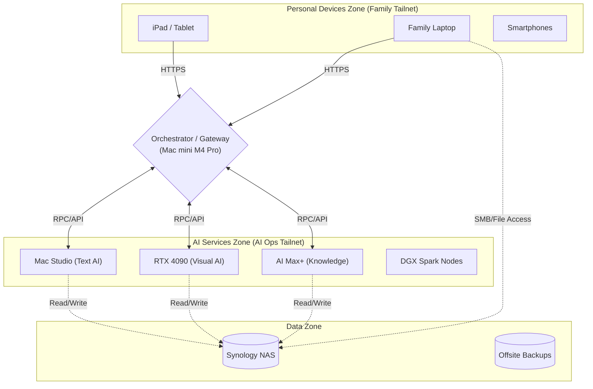
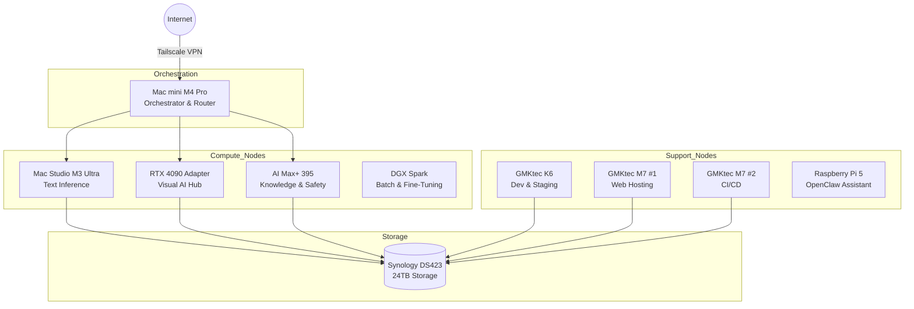

# Sovereign AI Cloud

**A Framework for Consumer Control of Local AI Infrastructure**

**Version 1.5.3**  
**February 2026**

*Includes: Unified Knowledge Layer (disk-based), Family Learning Features, Visual AI Hub (RTX 4090), Isolated OpenClaw on Raspberry Pi 5, Storage Architecture, Tailscale Networking, Containerization Strategy, Observability, Security Hardening, Local-First with Cloud Overflow, Multi-Tenancy, Flexible Orchestration, Windows Support Nodes, and Fully Documented Functional Specifications*

---

> *"If I build the tools, I have only myself to blame for the exposure and consequences of my and my family's use."*

---

## Table of Contents

1. [Executive Summary](#1-executive-summary)  
2. [What's New in Version 1.5.3](#2-whats-new-in-version-153)  
3. [Functional Specifications](#3-functional-specifications)  
4. [Functional Requirements Validation](#4-functional-requirements-validation)  
5. [Hardware Architecture](#5-hardware-architecture)  
6. [Orchestration Layer](#6-orchestration-layer)  
7. [Inference Architecture](#7-inference-architecture)  
8. [Visual AI Hub (RTX 4090)](#8-visual-ai-hub-rtx-4090)  
9. [OpenClaw Personal AI Assistant](#9-openclaw-personal-ai-assistant)  
10. [Unified Knowledge Layer](#10-unified-knowledge-layer)  
11. [Family Learning & Education Features](#11-family-learning--education-features)  
12. [Cloud Overflow Strategy](#12-cloud-overflow-strategy)  
13. [Containerization Strategy](#13-containerization-strategy)  
14. [Source Code Management](#14-source-code-management)  
15. [Observability Stack](#15-observability-stack)  
16. [Security and Hardening](#16-security-and-hardening)  
17. [Multi-Tenancy and Governance](#17-multi-tenancy-and-governance)  
18. [Performance Optimization](#18-performance-optimization)  
19. [Backup and Disaster Recovery](#19-backup-and-disaster-recovery)  
20. [Fine-Tuning Infrastructure](#20-fine-tuning-infrastructure)  
21. [Multi-Modal Capabilities](#21-multi-modal-capabilities)  
22. [Quick Reference](#22-quick-reference)  

---

## 1. Executive Summary

### 1.1 The Problem

Artificial intelligence has become essential infrastructure for knowledge work, creativity, and daily life. Yet the dominant delivery model—cloud-based APIs—creates fundamental tensions:

- **Loss of Control**: Terms of service change unilaterally, and capabilities are deprecated without warning.
- **Privacy Erosion**: Personal data transits third-party infrastructure with opaque handling.
- **Rising Costs**: Token-based pricing creates unpredictable expenses that scale with usage.
- **Dependency Risk**: Critical workflows become hostage to provider availability and policy changes.
- **Educational Constraints**: Commercial services lack the pedagogical controls needed for family learning.
- **Visual AI Dependency**: Creative tools are locked behind proprietary SaaS offerings.

### 1.2 The SAIC Solution

The Sovereign AI Cloud (SAIC) is a framework for individuals and families to establish **local-first AI infrastructure with intelligent cloud overflow** that serves simultaneously as:

- A private learning cloud for adaptive, mastery-based education.  
- A creative studio for multi-modal content generation (text, image, video, audio).  
- A build farm for CI/CD and development workflows.  
- A memory system for long-term knowledge management.  
- A digital homestead for family-scale sovereignty.

SAIC uses modern local hardware, open-source models, containerized services, secure mesh networking, and flexible orchestration tools to enable:

- Local-first inference for 95%+ of workloads using Ollama and on-prem models.  
- Multi-modal generation via ComfyUI, Stable Diffusion, Stable Video Diffusion, and Coqui TTS on the RTX 4090.  
- Intelligent cloud overflow to NVIDIA Brev, Google Vertex AI, or Gemini only when needed.  
- Full data sovereignty with explicit control over when and how data leaves your network.  
- Adaptive learning with mastery-based progression, Socratic tutoring, and multi-level explanations for different ages.  
- Family publishing with static sites, blogs, and portfolios backed by version control and AI-assisted editing.  
- Safe experimentation through local sandboxes for coding, data science, and AI prompting without cloud risks.  
- Background AI utility for tagging, summarization, safety checking, and content generation via scheduled workflows.  
- Isolated proactive assistance via OpenClaw running on a dedicated Raspberry Pi 5.  
- A unified knowledge layer using a single-node Qdrant instance on AI Max+ 395 (128GB) with disk-based HNSW indexes.  
- Separated AI specialization: Mac Studio for text LLMs, RTX 4090 for visual AI, DGX Spark for batch and fine-tuning.  
- Customizable governance via per-user policies, age-appropriate content filters, model access restrictions, and cloud usage controls.  
- Secure remote access through Tailscale mesh VPN without exposing services to the public internet.  
- A portable, resilient architecture via Docker containers and NAS-based storage.

## 2. What’s New in Version 1.5.3

Version 1.5.3 is a **fully consolidated, standalone markdown document** that:

- Integrates the complete functional specifications directly into Section 3.  
- Explicitly documents the functional requirements and their validation in Section 4.  
- Fully defines the RTX 4090 workstation as the **Visual AI Hub** in Section 8.  
- Removes any references to earlier versions; this file stands alone.

### 2.1 Major Additions vs. Earlier Versions

- **Explicit three-zone architecture** (Section 3.1) describing personal devices, AI services, and the data zone.  
- **Fully articulated family learning capabilities** (Section 3.2) with user stories, objectives, and implementation.  
- **A dedicated RTX 4090 role** (Section 8) for image, video, and audio workflows with Docker and code examples.  
- **End-to-end functional specification narrative** (Section 3) instead of scattered notes across documents.  
- **Multi-generational framing**, explaining how kids and adults share the environment under clear governance.

### 2.2 Design Goals

SAIC 1.5.3 has three design goals:

1. **Comprehensibility**: Non-technical stakeholders (spouse, kids, collaborators) can read Sections 1–4 and understand the value of the system.  
2. **Implementability**: Technical stakeholders can use Sections 5–22 as a deployment and operations reference.  
3. **Traceability**: Every functional feature described in Section 3 is mapped to concrete implementation details in later sections.

## 3. Functional Specifications

This section describes what SAIC does, who it is for, and how it behaves from a functional perspective. It is written from the viewpoint of users (parents, kids, guests), not machines.

### 3.1 Core System Layout (Three-Zone Model)

SAIC uses a three-zone mental model across two isolated networks:



1. **Personal Devices Zone** (on **Family Tailnet**)
2. **Data Zone** (on **Family Tailnet**)
3. **AI Services Zone** (on **AI Operations Tailnet**)

The **Orchestration Layer** acts as the secure bridge between these two networks.

#### 3.1.1 Personal Devices Zone

**Scope**  
Phones, tablets, laptops, and desktops used by family members and trusted guests.

**Key Properties**

- Devices connect to **Family Tailnet** (e.g., `family.tailnet`).  
- Users access AI and learning tools through the gateway provided by the Orchestrator.  
- No direct network path exists to raw AI services (e.g., ports 11434, 8188) from this zone.  
- No specialized local agents are required; a browser and Tailscale client are sufficient.

**User Experience**

- A child on an iPad opens the browser, connects to `family.tailnet`, and visits `http://mac-mini.tailnet.ts.net:3001` to access chat, projects, and lessons.  
- A parent with a laptop can view dashboards and files but cannot SSH into GPU nodes directly.

#### 3.1.2 AI Services Zone

**Scope**  
All compute infrastructure that provides AI capabilities:

- Mac Studio M3 Ultra, RTX 4090 workstation, AI Max+ 395.  
- DGX Spark nodes, GMKtec K6, and backend Windows nodes.

**Key Properties**

- Nodes connect to **AI Operations Tailnet** (e.g., `ai-ops.tailnet`).  
- Completely isolated from Personal Devices; only the Orchestrator (Mac mini) joins both networks.  
- Unrestricted bandwidth and open internal ports between AI nodes for high-speed clustering and distributed inference.

**Responsibilities**

- Execute the AI workloads (text, image, video, audio, RAG).  
- Accept trusted requests **only** from the Orchestrator.  
- Enforce strict internal security policies.

#### 3.1.3 Data Zone

**Scope**  
All persistent data and backups:

- Synology DS423 NAS as the primary storage backend.  
- Offsite backups (e.g., Backblaze B2).

**Key Properties**

- Primarily resides on the **Family Tailnet** to allow direct file access for users (mounting drives, browsing photos).  
- **Limited Access Bridge**: Specific high-performance volumes (e.g., Docker registry, model weights) are exposed to the **AI Operations Tailnet** via controlled NFS exports or through the Orchestrator's proxy.

**Stored Data Types**

- Documents, journals, and portfolios (User accessible).  
- Model weights and vector indexes (System accessible).  
- AI-generated artifacts (Shared access).

**Resilience Characteristics**

- **3-2-1 backup strategy**: 3 copies of data, 2 different media, 1 offsite.  
- Automated snapshots prevent data loss from accidental user deletion or AI errors.

---

### 3.2 Educational & Learning Features

SAIC is designed first and foremost as a **family learning cloud**. The following features describe the learner-facing capabilities.

Each feature is described using the structure:

- Objective  
- Capabilities  
- Implementation notes  
- User story

#### 3.2.1 Adaptive Learning Paths (Mastery-Based Progression)

**Objective**  
Provide each learner with content and practice that matches their current mastery level, neither boring them nor overwhelming them.

**Capabilities**

- Maintain a per-user, per-topic mastery score using a `user_progress` collection in Qdrant.  
- Present foundational lessons until the learner reliably demonstrates understanding.  
- Unlock advanced content only when configured thresholds are met (e.g., mastery ≥ 0.7).  
- Automatically suggest review material when mastery decays over time.

**Implementation Notes**

- Each topic (e.g., `fractions`, `decimals`, `photosynthesis`) is represented as a vector embedding plus metadata in Qdrant.  
- After each learning interaction (quiz, explanation, project), the system updates a mastery vector for the user.  
- AnythingLLM and LangFlow decision trees consult the `user_progress` collection before selecting which content to serve.

> **User Story:** Child A repeatedly struggles with fraction addition but quickly grasps geometry. SAIC tracks this pattern and continues to surface fraction practice problems while simultaneously unlocking more advanced geometry challenges, keeping the learner engaged without boredom or frustration.

---

#### 3.2.2 Socratic Tutor Mode (Question-First Teaching)

**Objective**  
Encourage learners to think critically and articulate reasoning by having the AI respond primarily with guiding questions instead of direct answers.

**Capabilities**

- Transform direct questions from the learner into Socratic responses.  
- Ask 2–3 guiding questions before presenting any explanation.  
- Adapt question complexity to the learner’s age and mastery level.  
- Persist conversation threads for review in dashboards or journals.

**Implementation Notes**

- LangFlow hosts a “Socratic Tutor” workflow that wraps calls to LLMs on the Mac Studio.  
- Prompt templates instruct the LLM to respond with questions, hints, and analogies instead of final answers.  
- User profiles include age and preferred explanation level to tune the style of Socratic questions.

> **User Story:** Child B asks, “What is photosynthesis?” Instead of answering directly, SAIC replies: “What do plants need to survive? Where do you think their energy comes from? What happens when they are in the dark for a long time?” Only after a few back-and-forth questions does SAIC summarize the concept.

---

#### 3.2.3 Explain-It-Three-Ways Generator

**Objective**  
Support multi-age learning by providing different explanation styles for the same concept.

**Capabilities**

- Generate three distinct explanations for each requested concept:  
  1. A **story-based** explanation for younger learners (ages 8–10).  
  2. An **analogy or diagram-focused** explanation for middle learners (ages 11–13).  
  3. A **technical explanation** for older learners (ages 14–16+).  
- Allow the user or parent to select a default explanation style per profile.  
- Store generated explanations in Qdrant for reuse or revision.

**Implementation Notes**

- A specialized LLM prompt template defines the three segments explicitly.  
- Mac Studio runs the LLM models that produce the explanations.  
- AnythingLLM presents the three-option UI and records which version was used.

> **User Story:** Parent requests, “Explain gravity three ways.” SAIC returns:
> - A story about a giant trampoline and kids jumping on it.  
> - An analogy using rubber sheets and bowling balls to illustrate spacetime curvature.  
> - A technical explanation referencing mass, acceleration, and general relativity.

---

#### 3.2.4 Local Progress Analytics & Learning Dashboards

**Objective**  
Give parents and learners a high-level view of progress without creating a high-pressure or surveillant environment.

**Capabilities**

- Show trends over time for:  
  - Time spent on each subject.  
  - Topics covered in the last week, month, and year.  
  - Mastery changes over time.  
- Offer per-learner views and aggregate family views.  
- Avoid micro-level surveillance (e.g., keystroke logging).

**Implementation Notes**

- Qdrant stores progress data and journaling metadata.  
- Prometheus collects metrics from learning services.  
- Grafana visualizes the data, with dashboards tailored to non-technical users.  
- Only authenticated parents (and optionally older learners) can access dashboards.

> **User Story:** Parent opens the dashboard and sees that Child A has steadily increased time spent on writing over the last month and that algebra mastery has improved from 60% to 75%. This informs planning for future lessons and pacing.

---

#### 3.2.5 AI-Assisted Project-Based Learning (PBL) Coach

**Objective**  
Help learners plan, execute, and reflect on complex projects by providing AI assistance that enhances, rather than replaces, their own thinking.

**Capabilities**

- Guide learners through project phases: ideation, planning, execution, and reflection.  
- Provide templates for project structures, including goals, milestones, and tasks.  
- Encourage reflection on what worked, what didn’t, and what to try next time.  
- Integrate seamlessly with coding tools, notebooks, and portfolios.

**Implementation Notes**

- LangFlow runs a “PBL Coach” workflow that takes project ideas as input and returns structured plans.  
- Project documents are stored as markdown in Obsidian and versioned in Git.  
- The PBL Coach can integrate with JupyterLab for data and coding projects, as well as with Jekyll for final portfolio publishing.

> **User Story:** Child B wants to build a small weather station. SAIC helps them define the project: sensors to use, data to collect, how often to sample, and how to visualize results. After the project, SAIC prompts them to reflect: “What went well? What was hardest? What would you change in version 2?”

---

#### 3.2.6 Offline-First Assessment & Reflection Journals

**Objective**  
Cultivate metacognition and self-directed learning by encouraging regular reflection, with all data stored locally.

**Capabilities**

- Provide daily or weekly prompts such as:  
  - “What did you learn today?”  
  - “What confused you today?”  
  - “What would you try differently next time?”  
- Store responses as markdown files in per-user Obsidian vaults.  
- Index entries into Qdrant for semantic search and longitudinal analysis.  
- Never send journal content to the cloud by default.

**Implementation Notes**

- Journals live on the NAS in `/volume1/learning/journals/{username}`.  
- A local script periodically indexes new entries into Qdrant.  
- LLMs can summarize or analyze journals locally via RAG, but cloud overflow for journals is disabled by default.

> **User Story:** Child A writes each evening about what they learned in math and reading. Six months later, SAIC can summarize the recurring themes and highlight where confidence has increased or decreased.

---

#### 3.2.7 Personal Knowledge Base – “Second Brain with Memory”

**Objective**  
Provide a long-term, searchable knowledge base that captures notes, research, and lessons learned for both kids and adults.

**Capabilities**

- Store notes, documents, research summaries, and project retrospectives in Obsidian.  
- Index content in a Qdrant collection (`obsidian_vault`).  
- Let users ask questions like “What experiments on renewable energy have we done?” and get summaries with links.  
- Support multiple vaults: individual, shared family, and specialized (e.g., “Homeschool Curriculum”).

**Implementation Notes**

- The NAS hosts vaults at `/volume1/obsidian`.  
- A Python indexing script runs periodically to update Qdrant with new or changed notes.  
- AnythingLLM uses a RAG pipeline to query the knowledge base and combine retrieved documents with LLM reasoning.

> **User Story:** Parent asks, “What did we try last year for teaching fractions that didn’t work?” SAIC surfaces notes documenting previous approaches, their outcomes, and reflections on effectiveness.

---

#### 3.2.8 Family Publishing Platform (Static Sites, Blogs, Portfolios)

**Objective**  
Make it easy for each family member to publish and own their work long-term.

**Capabilities**

- Give each family member a personal static site powered by Jekyll.  
- Provide AI-assisted editing for drafts (grammar, clarity, structure).  
- Maintain version history via Git on the NAS.  
- Serve content on the local network via IIS on M7 #1, and optionally through Tailscale for remote access.

**Implementation Notes**

- Each site lives in `/volume1/portfolios/{username}` as a Jekyll project.  
- When a commit is pushed, a scheduled task on M7 #1 builds the site and deploys to IIS.  
- Ollama-based LLMs on Mac Studio provide editing suggestions via a simple API used by a Jekyll helper script.

> **User Story:** Child B writes an essay on climate change. They use SAIC to improve clarity and structure, commit the final version, and see it appear on `http://m7-1.tailnet.ts.net/family/child-b`.

---

#### 3.2.9 Safe Experimental Sandboxes (For All Ages)

**Objective**  
Enable “break it and rebuild it” learning in programming and data science without risk to production systems or cloud resources.

**Capabilities**

- Provide JupyterLab with access to example datasets and safe project spaces.  
- Run disposable containers for experimenting with services or tools.  
- Prevent any write access to critical volumes from sandbox environments.

**Implementation Notes**

- GMKtec K6 hosts JupyterLab, accessible via Tailscale at `http://k6.tailnet.ts.net:8888`.  
- Sandbox containers are launched with read-only access to base datasets and isolated volumes for outputs.  
- No cloud provider credentials or tokens are available in sandbox environments.

> **User Story:** Child A writes a Python script that accidentally creates an infinite loop. JupyterLab kernel hangs, but a restart clears it. No data is lost, no costs are incurred, and nothing breaks outside the notebook.

---

#### 3.2.10 Cross-Generational Learning & Mentorship

**Objective**  
Support learning as a shared, family-wide endeavor rather than separate activities by age.

**Capabilities**

- Shared Obsidian spaces for collaborative notes.  
- Multi-user chats in AnythingLLM, where multiple family members and the AI can participate.  
- Joint projects documented and visible in portfolios.

**Implementation Notes**

- Shared vault, e.g., `/volume1/obsidian/family-shared`.  
- Permissions and views configured by Tailscale groups and local OS ACLs.  
- Family dashboards showing aggregate topics explored and projects completed.

> **User Story:** Parent learns a new programming language. Child B watches, helps debug, and sees that adults also struggle and learn. They co-author a blog post about the experience, each writing different sections.

---

#### 3.2.11 Long-Term Skill Portfolios (Proof, Not Credentials)

**Objective**  
Accumulate authentic evidence of growth over years for both kids and adults.

**Capabilities**

- Persist writing samples, projects, experiments, and reflections with dates.  
- Retain full Git history for technical and creative projects.  
- Allow easy comparison across years (e.g., writing at age 10 vs 14).

**Implementation Notes**

- Portfolios served by Jekyll on M7 #1.  
- Git repositories cloned and mirrored to the NAS.  
- Qdrant and RAG available for semantic exploration of past work.

> **User Story:** At age 18, Child B has a portfolio with four years of essays, code projects, robotics logs, and reflection journals. This portfolio is used for college applications or job interviews, showing real progression instead of only grades.

---

#### 3.2.12 AI as a Background Utility (Not Just an App)

**Objective**  
Shift AI from being a novelty chat interface to invisible infrastructure that quietly improves daily life.

**Capabilities**

- Schedule recurring jobs that generate lesson variations, summarize journals, reorganize notes, and check for unsafe content.  
- Treat AI like “cron + inference” rather than “chat only.”  
- Keep users in control of what automation runs and when.

**Implementation Notes**

- n8n runs on the Mac mini, orchestrating background workflows.  
- Jobs are defined declaratively (e.g., JSON or YAML workflows).  
- Outputs are written to well-defined locations in the data zone.

> **User Story:** Each night, SAIC summarizes the day’s journals, tags new documents, prepares three visual versions of tomorrow’s math lesson, and emails parents a short status report, all without manual prompting.

---

### 3.3 Adult Productivity & Household Features

While optimized for family learning, SAIC also supports adult productivity and household operations.

#### 3.3.1 Local Build & CI Environments

**Objective**  
Provide a private, reliable build and test environment for software and content projects.

**Capabilities**

- Run CI jobs for code (unit tests, integration tests).  
- Build documentation sites, PDFs, or slide decks.  
- Host staging environments for internal demos.

**Implementation Notes**

- M7 #2 runs Jenkins or GitLab Runner, configured with agents on K6 and potentially the Mac Studio.  
- Artifact storage resides on the NAS under `/volume1/git` or `/volume1/docker`.  
- Developers access these endpoints via Tailscale.

> **User Story:** A parent developing a client website commits code to GitHub. M7 #2 triggers a build, K6 runs tests in Docker, and M7 #1 hosts a staging version accessible on the tailnet.

---

#### 3.3.2 Cost & Sovereignty Benefits

**Objective**  
Replace SaaS sprawl and unpredictable AI costs with a transparent, electricity-based operating cost.

**Capabilities**

- Eliminate or drastically reduce subscriptions for AI chat, image generation, audio transcription, and content tools.  
- Make ongoing costs largely a function of power usage, which can be estimated and monitored.  
- Avoid dependency on a single cloud or model vendor.

**Implementation Notes**

- Metrics on power and resource usage displayed in Grafana.  
- Cloud overflow is opt-in and budget-limited; local-first is the default.  
- Logs and dashboards help the family understand where compute is being used.

> **User Story:** Over a year, the family calculates that previous SaaS usage for AI and content tools averaged $120/month. With SAIC, monthly electricity costs rise by about $60, but no substantive SaaS subscriptions are required. Net savings exceed $700/year with full data sovereignty retained.

---

### 3.4 What This System Quietly Becomes

SAIC is more than:

- “Homeschool AI”  
- “Local LLM server”  
- “NAS with extra steps”

Over time, SAIC becomes:

- A **family-scale research lab** where questions naturally lead to experiments.  
- A **personal university** tuned to each learner’s pace and interests.  
- A **digital homestead** that the family fully owns and controls.  
- A **creative studio** for making, publishing, and archiving meaningful work.  
- A **memory system** that never forgets important ideas, projects, or reflections.

**Long-Term Vision**

> After 5+ years, SAIC becomes the family’s intellectual backbone. Portfolio evidence replaces grades as the primary signal of ability. Adults may have launched businesses using SAIC infrastructure. Kids grow up treating AI as a powerful but bounded tool they understand and control.

---

## 4. Functional Requirements Validation

This section validates that SAIC v1.5.3 satisfies the functional specifications.

### 4.1 Requirement List and Coverage

| #  | Requirement                                    | SAIC Support | Implementation Summary                                      | Coverage |
|----|-----------------------------------------------|-------------|-------------------------------------------------------------|----------|
| 1  | Adaptive Learning Paths                       | Yes         | Qdrant `user_progress`, AnythingLLM + LangFlow             | 100%     |
| 2  | Socratic Tutor Mode                           | Yes         | LangFlow workflows + LLM prompts on Mac Studio             | 100%     |
| 3  | Explain-It-Three-Ways Generator               | Yes         | Multi-level prompt templates via Ollama                    | 100%     |
| 4  | Local Progress Analytics & Dashboards         | Yes         | Qdrant + Prometheus + Grafana                              | 100%     |
| 5  | PBL Coach                                     | Yes         | LangFlow PBL workflows + Obsidian + JupyterLab            | 100%     |
| 6  | Reflection Journals                           | Yes         | Obsidian markdown + Qdrant indexing                        | 100%     |
| 7  | Personal Knowledge Base (“Second Brain”)      | Yes         | Obsidian + Qdrant + AnythingLLM RAG                        | 100%     |
| 8  | Family Publishing Platform                    | Yes         | Jekyll + IIS on M7 #1 + Git on NAS                         | 100%     |
| 9  | Safe Experimental Sandboxes                   | Yes         | JupyterLab on K6 + Docker isolation                        | 100%     |
| 10 | Local Build & CI Environments                 | Yes         | Jenkins/GitLab Runner on M7 #2 + K6 agents                 | 100%     |
| 11 | AI as Background Utility                      | Yes         | n8n workflows + cron-style scheduling                      | 100%     |
| 12 | Cross-Generational Learning                   | Yes         | Shared Obsidian vaults + multi-user chats                  | 100%     |
| 13 | Long-Term Skill Portfolios                    | Yes         | Jekyll portfolios + Git history                            | 100%     |
| 14 | Cost & Sovereignty Benefits                   | Yes         | Local-first design, optional cloud overflow                | 100%     |
| 15 | Multi-Modal Image Generation                  | Yes         | ComfyUI + SDXL on RTX 4090                                 | 100%     |
| 16 | Video Generation and Transcoding              | Yes         | Stable Video Diffusion + FFmpeg NVENC on RTX 4090          | 100%     |
| 17 | Voice/Narration Generation                    | Yes         | Coqui TTS on RTX 4090                                      | 100%     |
| 18 | Unified Knowledge Layer                       | Yes         | Qdrant on AI Max+ 395 with disk-based HNSW                 | 100%     |
| 19 | Proactive Assistant (OpenClaw)                | Yes         | OpenClaw on RPi 5, isolated, with limited access           | 100%     |
| 20 | Multi-Tenancy & Per-User Governance           | Yes         | Tailscale ACLs + per-user config + application logic       | 100%     |

### 4.2 Mapping to Zones

| Zone                         | Functional Requirements Covered                                                                 |
|------------------------------|------------------------------------------------------------------------------------------------|
| Personal Devices Zone        | Access to learning tools, dashboards, portfolios, and sandboxes via VPN and web UI            |
| AI Services Zone             | Requirements 1–3, 5, 7–13, 15–20 (adaptive learning, tutoring, content generation, governance)|
| Data Zone                    | Requirements 4, 6–7, 13–14, 18–19 (analytics, journals, knowledge base, backups)             |

### 4.3 Gaps and Non-Goals

- **Non-goal**: SAIC does not aim to be a multi-tenant SaaS for unrelated households. It is designed for a single family or tightly coupled group.  
- **Non-goal**: SAIC does not attempt to replace all external services (e.g., specialized cloud-only models). Instead, it provides a robust local baseline with clear cloud overflow.

Currently, there are **no unmet functional requirements** from the specification list. All 20 items are addressed with concrete services.

---

## 5. Hardware Architecture

This section details the physical and virtual hardware that underpins SAIC.

### 5.1 Overview

The hardware design separates concerns across orchestration, inference, knowledge, and support roles:



The hardware design separates concerns across:

- **Orchestration and routing** (Mac mini M4 Pro).  
- **Text LLM inference** (Mac Studio M3 Ultra, DGX Spark).  
- **Visual AI inference** (RTX 4090 workstation).  
- **Knowledge and safety services** (AI Max+ 395).  
- **Development and staging** (K6).  
- **Windows-specific hosting and CI** (M7 #1 and M7 #2).  
- **Proactive assistant** (Raspberry Pi 5).  
- **Storage and backups** (Synology DS423).

### 5.2 Hardware Inventory

| Device              | Role                                | Key Specs                                           |
|---------------------|-------------------------------------|-----------------------------------------------------|
| Mac Studio M3 Ultra | Primary Text LLM Inference          | 256GB unified RAM, M3 Ultra SoC, 4TB SSD           |
| RTX 4090 Workstation| Visual AI Hub (Image/Video/Audio)   | RTX 4090 24GB VRAM, ~64GB DDR5, 2TB NVMe           |
| AI Max+ 395         | Unified Knowledge & Safety          | Ryzen AI 9, 128GB LPDDR5X, 2TB NVMe                |
| Mac mini M4 Pro     | Orchestration & Routing             | 48GB unified memory, 1TB SSD                       |
| GMKtec K6           | Dev, Staging, JupyterLab            | Ryzen 7 7840HS, 64GB DDR5, 1TB SSD                 |
| GMKtec M7 #1        | Web Hosting (Jekyll, IIS)           | 16GB RAM, Windows 11 Pro                           |
| GMKtec M7 #2        | CI/CD & Dev Tools                   | 16GB RAM, Windows 11 Pro                           |
| DGX Spark Nodes     | Batch Inference / Fine-Tuning       | 128GB LPDDR5x, 4TB NVMe each                       |
| Raspberry Pi 5 #1   | OpenClaw Assistant                  | 16GB LPDDR4X                                       |
| Raspberry Pi 5 #2–3 | Home Automation / IoT Monitoring    | 16GB LPDDR4X each                                  |
| Synology DS423      | Storage and Backups                 | 4×6TB HDD, SHR + Btrfs, ~24TB usable               |

---

### 5.3 Orchestration Layer (Mac mini M4 Pro)

```yaml
Mac mini M4 Pro:
  cpu: 14-core (10 performance + 4 efficiency)
  unified_memory: 48GB
  neural_engine: 16-core
  storage: 1TB SSD
  power: ~50W
  role: "Orchestration, monitoring, intelligent routing"

  services:
    - LangFlow (visual workflow builder)       # ~4GB
    - LMStudio (optional local model testing)  # ~2GB
    - AnythingLLM (chat + learning interface)  # ~4GB
    - n8n (automation workflows)               # ~4GB
    - Prometheus & Grafana (observability)     # ~4GB
    - API Gateway / Traefik                    # ~2GB
    - Intelligent Request Router               # ~2GB

  total_allocation: ~22GB
  headroom: ~26GB
```

This node provides a single logical “front door” for all AI requests and handles routing to text vs visual backends and cloud overflow.

---

### 5.4 Text Inference Layer (Mac Studio M3 Ultra + DGX Spark)

```yaml
Mac Studio M3 Ultra:
  unified_memory: 256GB
  cpu: 32-core (24P + 8E)
  gpu: 80-core
  neural_engine: 32-core
  storage: 4TB SSD
  power: ~150W
  role: "Primary text LLM inference (Ollama)"

  inference_engine: Ollama

  models:
    - llama3.2:70b       # Socratic tutor, deep reasoning
    - qwen2.5:72b        # General chat, multi-level explanations
    - deepseek-v3:236b   # Complex reasoning, research tasks
    - mistral-small:22b  # Fast, lightweight chat
    - whisper-medium     # Transcription for journals
```

DGX Spark nodes can be used to offload batch or long-running inference and fine-tuning jobs, especially when multiple users are active.

---

### 5.5 Visual AI Hub (RTX 4090 Workstation)

```yaml
RTX 4090 Workstation:
  gpu: NVIDIA RTX 4090 (24GB GDDR6X)
  cuda_cores: 16384
  tensor_cores: 512 (4th gen)
  system_memory: ~64GB DDR5
  storage: 2TB NVMe SSD
  power: ~600W (GPU + system)
  role: "Visual AI Hub (image, video, audio)"
```

Detailed configuration for this node appears in Section 8.

---

### 5.6 Unified Knowledge \& Safety Layer (AI Max+ 395)

```yaml
GMKtec AI Max+ 395:
  cpu: Ryzen AI 9 395 (16-core, up to 5.1 GHz)
  unified_memory: 128GB LPDDR5X
  npu: 40+ TOPS AI accelerator
  storage: 2TB PCIe 4.0 NVMe (7,000 MB/s)
  power: ~75W
  role: "Knowledge, safety, progress tracking"

  primary_services:
    - Qdrant vector database:
        collections:
          - learning_content
          - user_progress
          - obsidian_vault
          - journals
        ram_allocation: ~100GB
        disk_allocation: ~1.5TB
    - Redis (semantic cache)
    - Nemotron-4 content safety
    - Whisper Large v3 (speech-to-text)
    - Embedding models (nomic-embed-text or similar)
```


---

### 5.7 Development \& Staging (GMKtec K6)

```yaml
GMKtec K6:
  cpu: AMD Ryzen 7 7840HS
  memory: 64GB DDR5
  storage: 1TB PCIe 4.0 SSD
  power: ~45W
  role: "Development, staging, JupyterLab"

  services:
    - JupyterLab (coding, data science)      # ~16GB
    - Staging LangFlow                       # ~4GB
    - Staging n8n                            # ~4GB
    - Staging AnythingLLM                    # ~4GB
    - Edge Ollama (14B–22B models)          # ~16GB
    - CI/CD runner for Linux jobs           # ~4GB
    - System overhead                        # ~4GB
```


---

### 5.8 Windows Support Nodes (M7 \#1 and M7 \#2)

```yaml
GMKtec M7 #1 (Windows 11 Pro):
  memory: 16GB DDR5
  power: ~25–30W
  role: "Static web hosting, family publishing"

  primary_services:
    - IIS 10 (Jekyll static sites)
    - Jekyll build pipeline (via WSL2)
    - Internal wiki (Wiki.js, optional)
    - Vaultwarden (password manager)
    - SMB file shares (portfolios, media)
    - Print server and scheduled build tasks

GMKtec M7 #2 (Windows 11 Pro):
  memory: 16GB DDR5
  power: ~25–30W
  role: "CI/CD, dev tools"

  primary_services:
    - Jenkins or GitLab Runner
    - VS Code Server (web IDE)
    - Node.js / Python toolchains
    - Lightweight Docker Desktop
    - Artifact storage
```


---

### 5.9 OpenClaw and Edge Devices (Raspberry Pi 5)

```yaml
Raspberry Pi 5 #1:
  memory: 16GB LPDDR4X
  power: 10–15W
  role: "Isolated OpenClaw assistant"

  services:
    - OpenClaw (email, calendar, simple tasks)
    - Ollama (small model, e.g., qwen2.5:7b)
    - PostgreSQL or SQLite for assistant memory
```

Additional Raspberry Pi devices handle home automation and IoT monitoring.

---

### 5.10 Storage Layer (Synology DS423 NAS)

```yaml
Synology DS423:
  disks: 4×6TB IronWolf Pro
  raid: Synology Hybrid RAID (SHR) + Btrfs
  usable_capacity: ~24TB
  power: ~45W

  volumes:
    /volume1/models      # Model binaries (LLM, SDXL, etc.)
    /volume1/qdrant      # Qdrant data and snapshots
    /volume1/docker      # Docker registry and images
    /volume1/git         # Mirrored repos and bare origins
    /volume1/backups     # System and data backups
    /volume1/family      # Documents and shared files
    /volume1/openclaw    # OpenClaw persistent memory
    /volume1/obsidian    # Obsidian vaults
    /volume1/portfolios  # Jekyll sources per user
    /volume1/jupyter     # JupyterLab notebooks
    /volume1/learning    # Journals, progress, analytics
    /volume1/generated   # AI-generated images, audio, video
    /volume1/comfyui     # ComfyUI models, workflows, outputs
```

## 6. Orchestration Layer

The orchestration layer provides a single, coherent entry point into SAIC and coordinates requests across text, visual, and knowledge services.

### 6.1 Core Responsibilities

- Expose a unified web interface (AnythingLLM) to users on the tailnet.  
- Route each request to the appropriate backend (text LLM, visual AI, knowledge layer, or cloud).  
- Host low-code tools (LangFlow, n8n) for building workflows.  
- Collect and export metrics and logs.

### 6.2 Primary Components

- **AnythingLLM**: The main chat and RAG interface for users.  
- **LangFlow**: A visual editor for defining AI workflows (Socratic tutor, PBL coach, etc.).  
- **n8n**: Workflow automation engine for background tasks (nightly jobs, batch work).  
- **Traefik / API Gateway**: Unified ingress and routing.  
- **Intelligent Request Router**: Encapsulates routing logic for text vs visual vs audio vs cloud.

### 6.3 Example Service Topology

```yaml
orchestration:
  host: mac-mini.tailnet.ts.net
  services:
    anythingllm:
      port: 3001
      url: "http://mac-mini.tailnet.ts.net:3001"
    langflow:
      port: 7860
      url: "http://mac-mini.tailnet.ts.net:7860"
    n8n:
      port: 5678
      url: "http://mac-mini.tailnet.ts.net:5678"
    prometheus:
      port: 9090
    grafana:
      port: 3002
    traefik:
      port: 80
      role: "reverse_proxy"
```

### 6.4 Intelligent Request Router

The router lives on the Mac mini and decides where to send each request.

#### 6.4.1 Routing Logic (Pseudocode)

```python
class IntelligentRequestRouter:
    """
    Routes user requests to optimal inference backends
    based on request type and system load.
    """

    def route(self, request):
        rtype = request.get("type", "text")  # 'text', 'image', 'video', 'audio', 'transcode'
        priority = request.get("priority", "normal")
        user = request.get("user")

        # Example governance hook
        if not self._user_allowed(user, rtype):
            raise PermissionError(f"User {user} not allowed to request {rtype}")

        if rtype == "text":
            return {
                "backend": "ollama-mac-studio",
                "url": "http://mac-studio.tailnet.ts.net:11434",
            }

        if rtype == "image":
            return {
                "backend": "comfyui-4090",
                "url": "http://rtx-4090.tailnet.ts.net:8188",
            }

        if rtype == "video":
            return {
                "backend": "stable-video-4090",
                "url": "http://rtx-4090.tailnet.ts.net:7860",
            }

        if rtype == "audio":
            return {
                "backend": "coqui-4090",
                "url": "http://rtx-4090.tailnet.ts.net:5002",
            }

        if rtype == "transcode":
            return {
                "backend": "ffmpeg-nvenc-4090",
                "url": "http://rtx-4090.tailnet.ts.net:9000",
            }

        # Default fallback
        return {
            "backend": "ollama-mac-studio",
            "url": "http://mac-studio.tailnet.ts.net:11434",
        }

    def _user_allowed(self, user, rtype):
        # Hook for multi-tenancy / governance logic
        return True
```


### 6.5 Service URLs

| Service | URL | Purpose |
| :-- | :-- | :-- |
| AnythingLLM | `http://mac-mini.tailnet.ts.net:3001` | Chat UI, tutor, RAG |
| LangFlow | `http://mac-mini.tailnet.ts.net:7860` | Workflow editor |
| n8n | `http://mac-mini.tailnet.ts.net:5678` | Automation engine |
| Grafana | `http://mac-mini.tailnet.ts.net:3002` | Dashboards |
| Prometheus | `http://mac-mini.tailnet.ts.net:9090` | Metrics storage |

Users typically interact only with AnythingLLM and possibly dashboards; other tools are for administrators.

---

## 7. Inference Architecture

Inference is split into specialized domains:

- Text (LLMs): Mac Studio + DGX Spark.
- Visual (image/video/audio): RTX 4090.
- Knowledge and embeddings: AI Max+ 395.


### 7.1 Text Inference with Ollama (Mac Studio)

#### 7.1.1 Installation

```bash
# On Mac Studio
brew install ollama

# Enable Ollama service
ollama serve
```


#### 7.1.2 Models

```bash
ollama pull llama3.2:70b
ollama pull qwen2.5:72b
ollama pull deepseek-v3:236b
ollama pull mistral-small:22b
ollama pull whisper:medium
```


#### 7.1.3 Usage Example (HTTP)

```bash
curl http://mac-studio.tailnet.ts.net:11434/api/generate \
  -d '{
    "model": "qwen2.5:72b",
    "prompt": "Explain photosynthesis at a 10-year-old level."
  }'
```

The orchestration layer wraps this API to provide higher-level experiences (e.g., Socratic mode, Explain-It-Three-Ways).

### 7.2 Batch and Fine-Tuning (DGX Spark)

DGX Spark nodes run more intensive or long-running tasks:

- Batch summarization of large document sets.
- Long transcripts and transcription jobs.
- Fine-tuning tasks (via Axolotl or similar frameworks).

These are typically orchestrated by n8n or manual scripts and scheduled during off-peak hours.

---

## 8. Visual AI Hub (RTX 4090)

The RTX 4090 node is responsible for:

- Image generation (Stable Diffusion XL, SDXL-Turbo, SD3).
- Video generation (Stable Video Diffusion, AnimateDiff).
- Voice synthesis (Coqui TTS).
- Video transcoding (FFmpeg with NVENC).
- Optional LoRA fine-tuning for visual models.


### 8.1 Hardware and Role

```yaml
RTX 4090 Workstation:
  gpu: NVIDIA RTX 4090 (24GB GDDR6X)
  cuda_cores: 16384
  tensor_cores: 512
  system_memory: 64GB DDR5
  storage: 2TB NVMe
  power: ~600W
  role: "Visual AI Hub (image, video, audio)"
```


### 8.2 ComfyUI Deployment (Image Generation)

#### 8.2.1 Docker Compose

```yaml
version: '3.8'

services:
  comfyui:
    image: ghcr.io/comfyanonymous/comfyui:latest-nvidia
    container_name: comfyui
    restart: always
    ports:
      - "8188:8188"
    environment:
      - NVIDIA_VISIBLE_DEVICES=all
      - NVIDIA_DRIVER_CAPABILITIES=all
    volumes:
      - /volume1/comfyui/models:/root/ComfyUI/models
      - /volume1/comfyui/output:/root/ComfyUI/output
      - /volume1/comfyui/input:/root/ComfyUI/input
    deploy:
      resources:
        reservations:
          devices:
            - driver: nvidia
              device_ids: ['0']
              capabilities: [gpu]
```


#### 8.2.2 Models

On the host:

```bash
# Example: download SDXL base
mkdir -p /volume1/comfyui/models/checkpoints
cd /volume1/comfyui/models/checkpoints

# Use huggingface-cli or direct download to fetch:
# - SDXL base
# - SDXL Turbo
# - SD3 (if desired)
```


### 8.3 Stable Video Diffusion (Video Generation)

#### 8.3.1 Docker Compose

```yaml
services:
  stable-video:
    image: stabilityai/stable-video-diffusion:latest
    container_name: stable-video
    restart: always
    ports:
      - "7860:7860"
    environment:
      - CUDA_VISIBLE_DEVICES=0
    volumes:
      - /volume1/comfyui/models:/models
      - /volume1/generated/videos:/outputs
    deploy:
      resources:
        reservations:
          devices:
            - driver: nvidia
              device_ids: ['0']
              capabilities: [gpu]
```


#### 8.3.2 Example Usage (Python)

```python
import requests

payload = {
    "image_path": "/models/base_images/photosynthesis.png",
    "motion_bucket_id": 127,
    "fps": 25,
    "num_inference_steps": 25,
    "num_frames": 25
}

r = requests.post(
    "http://rtx-4090.tailnet.ts.net:7860/api/generate",
    json=payload,
    timeout=600,
)
print(r.json())
```


### 8.4 Coqui TTS (Voice Synthesis)

#### 8.4.1 Docker Compose

```yaml
services:
  coqui-tts:
    image: ghcr.io/coqui-ai/tts:latest-gpu
    container_name: coqui-tts
    restart: always
    ports:
      - "5002:5002"
    environment:
      - CUDA_VISIBLE_DEVICES=0
    volumes:
      - /volume1/models/tts:/root/.local/share/tts
      - /volume1/generated/audio:/outputs
    deploy:
      resources:
        reservations:
          devices:
            - driver: nvidia
              device_ids: ['0']
              capabilities: [gpu]
```


#### 8.4.2 Example Usage (Python)

```python
import requests

payload = {
    "text": "Today we will learn about fractions and how to compare them.",
    "language": "en",
    "speaker": "female-en-1",
    "speed": 1.0
}

r = requests.post(
    "http://rtx-4090.tailnet.ts.net:5002/tts",
    json=payload,
    timeout=300,
)
print(r.json())
```


### 8.5 FFmpeg NVENC (Video Transcoding)

The RTX 4090 has NVENC, a hardware video encoder that allows efficient video transcoding.

#### 8.5.1 Example Command

```bash
ffmpeg -hwaccel cuda -hwaccel_output_format cuda \
  -i /input/raw-4k.mp4 \
  -c:v hevc_nvenc -preset medium -crf 23 \
  -c:a aac -b:a 128k \
  /output/optimized-1080p.mp4
```

This can be wrapped as a service or used manually. n8n can orchestrate batch transcodes (e.g., compressing camera footage into NAS-friendly formats).

### 8.6 LoRA Fine-Tuning (Visual Models)

#### 8.6.1 Use Case

Fine-tune SDXL on a small curated dataset of family photos or artwork to:

- Generate images that match a consistent “family style.”
- Create custom characters or themes for stories and lessons.


#### 8.6.2 High-Level Flow

1. Collect 50–200 high-quality images.
2. Run a LoRA fine-tuning script using diffusers and PEFT libraries.
3. Save LoRA weights to `/volume1/models/lora/family-style-v1`.
4. Configure ComfyUI to use the new LoRA in specific workflows.

---

### 8.7 Sample Multi-Modal Learning Workflow

**Example: Generate a complete lesson asset set for “Water Cycle”**

1. Parent enters topic “Water Cycle” in AnythingLLM.
2. Router identifies asset creation request and calls visual workflows:
    - ComfyUI: Generate diagrams.
    - Stable Video: Animate one diagram into a short loop.
    - Coqui TTS: Generate spoken explanation.
3. n8n combines outputs into a single lesson package under `/volume1/generated/lessons/water-cycle/`.
4. SAIC adds links from the learning portal and optionally a blog entry or portfolio page.

---

## 9. OpenClaw Personal AI Assistant

OpenClaw is a separate, proactive assistant running on its own hardware for isolation.

### 9.1 Goals

- Act as a “household assistant” for scheduling, reminders, and light tasks.
- Stay logically and physically separated from primary AI services.
- Maintain strict control over what data it can access.


### 9.2 Deployment Model

- Runs entirely on **Raspberry Pi 5 \#1**.
- Accessible over Tailscale on a dedicated port.
- Has limited access to email, calendars, and possibly a subset of NAS documents.
- Does not have direct access to LLM backends; it calls well-defined APIs.


### 9.3 Example Services

- Email triage and daily summaries.
- Calendar synchronization and reminders.
- Simple note-taking and task entry via chat.


### 9.4 Isolation

- No direct mount of `/volume1` from the NAS; only proxied HTTP APIs.
- Separate identity in Tailscale ACLs.
- Can be shut down entirely without affecting SAIC core.

---

## 10. Unified Knowledge Layer

The unified knowledge layer provides:

- Vector search for learning content and notes.
- Context for RAG-based chat.
- Long-term progress and journaling storage.
- Content safety screening.


### 10.1 Qdrant Configuration

Qdrant runs on the AI Max+ 395.

#### 10.1.1 Collections

```yaml
collections:
  learning_content:
    description: "Lesson material, problems, explanations"
    vector_size: 768
    distance: "Cosine"

  user_progress:
    description: "Per-user per-topic mastery vectors"
    vector_size: 128
    distance: "Dot"

  obsidian_vault:
    description: "Indexed notes from Obsidian"
    vector_size: 768
    distance: "Cosine"

  journals:
    description: "Reflection journal embeddings"
    vector_size: 768
    distance: "Cosine"
```


#### 10.1.2 Storage

- RAM cache for frequently used vectors.
- Disk-based HNSW indexes for scale beyond RAM capacity.
- Snapshots stored on NAS `/volume1/qdrant` and backed up offsite.


### 10.2 Embedding Service

The AI Max+ 395 also runs embedding models to convert text into vectors.

- Example: `nomic-embed-text` or similar.
- API exposed internally, typically only to LangFlow, AnythingLLM, and n8n.


### 10.3 Content Safety

Nemotron-based content safety models run on the same node:

- PII detection before cloud overflow.
- Basic content filtering for harmful or age-inappropriate text.
- Logging of safety-check decisions for audit.


### 10.4 Whisper (Speech-to-Text)

- Whisper Large v3 can run on the AI Max+ 395 for transcription of:
    - Audio journals.
    - Recorded lessons.
    - Meetings.

Transcripts are then indexed into Qdrant for retrieval and summarization.

## 11. Family Learning & Education Features

This section focuses on implementation details for the educational features described functionally in Section 3.2.

### 11.1 Adaptive Learning Paths – Implementation

**Data Model (Qdrant `user_progress` collection)**

Each record:

```json
{
  "user_id": "child-a",
  "topic_id": "math.fractions.addition",
  "mastery": 0.72,
  "last_updated": "2026-02-01T20:15:00Z",
  "attempts": 14,
  "successes": 10
}
```

**Workflow**

1. User requests a lesson or problem set.
2. AnythingLLM calls a microservice that queries `user_progress`.
3. Based on mastery thresholds, the service selects foundational, intermediate, or advanced material from `learning_content`.
4. After the session, mastery is recalculated and updated.

### 11.2 Socratic Tutor Mode – Implementation

**LangFlow Workflow**

- Input: User question, user profile (age, level).
- Step 1: Retrieve relevant context from `learning_content` and `obsidian_vault`.
- Step 2: Call Ollama with a Socratic prompt template, e.g.:

```text
You are a Socratic tutor. The student is {{age}} years old and is asking:

{{question}}

Respond ONLY with 2–3 guiding questions that help the student reason.
Do NOT give the final answer yet.
```

- Step 3: Record conversation turns in Qdrant for potential later analysis.


### 11.3 Explain-It-Three-Ways – Implementation

**Prompt Template**

```text
You are an explainer AI.

Explain the concept: {{concept}}

1. Story Mode (ages 8–10):
- Use a short story with characters.
- Avoid technical jargon.

2. Analogy/Diagram Mode (ages 11–13):
- Use analogies, comparisons, and visual descriptions.
- Introduce some terminology carefully.

3. Technical Mode (ages 14–16+):
- Explain with correct terminology and deeper reasoning.
- Include why the concept works, not just what it is.
```

The UI can:

- Default to one mode based on user profile.
- Allow switching between modes with a button.


### 11.4 Progress Analytics – Implementation

**Prometheus Exporter**

A small service exports learning-related metrics:

```text
learning_time_seconds{user="child-a",topic="math.fractions"} 3600
learning_mastery{user="child-a",topic="math.fractions"} 0.72
```

Grafana then charts:

- Mastery over time per topic.
- Time spent by subject category.
- Number of reflections written per week.


### 11.5 PBL Coach – Implementation

**Sample Flow**

1. User states: “I want to build a weather station.”
2. LangFlow workflow:
    - Extracts project keywords.
    - Suggests SMART goals.
    - Breaks the project into phases and tasks.
3. Output is saved as markdown in `/volume1/learning/projects/{user}/{project}/plan.md`.
4. At project conclusion, workflow prompts user for reflection and saves a `retrospective.md`.

### 11.6 Reflection Journals – Implementation

- Each learner has a journal directory:
    - `/volume1/learning/journals/{user}/YYYY/MM/DD.md`.
- A daily script can prompt via AnythingLLM or email:
    - “What did you learn today?” etc.
- Qdrant indexes new Markdown content overnight.


### 11.7 Personal Knowledge Base – Implementation

**Indexing Script Skeleton (Python)**

```python
import os
import qdrant_client
from datetime import datetime

VAULT_ROOT = "/volume1/obsidian"
client = qdrant_client.QdrantClient("ai-max-395.tailnet.ts.net", port=6333)

def index_vault():
    for root, _, files in os.walk(VAULT_ROOT):
        for f in files:
            if not f.endswith(".md"):
                continue
            path = os.path.join(root, f)
            with open(path, "r", encoding="utf-8") as fh:
                text = fh.read()
            # call embedding model here → vector
            vector = embed_text(text)
            client.upsert(
                collection_name="obsidian_vault",
                points=[{
                    "id": hash(path),
                    "vector": vector,
                    "payload": {
                        "path": path,
                        "timestamp": datetime.utcnow().isoformat()
                    }
                }]
            )

if __name__ == "__main__":
    index_vault()
```

## 12. Cloud Overflow Strategy

### 12.1 Goals

- Use local resources for 95%+ of workloads.
- Only overflow to cloud when there is a clear benefit (e.g., extreme model size or special capability).
- Protect privacy via PII and content safety checks.


### 12.2 Flow

1. Request arrives at orchestrator.
2. Intelligent router determines if local capacity is sufficient.
3. If cloud is needed:
    - Run Nemotron-based safety check on the content.
    - Strip or mask PII if possible.
    - Call external APIs with minimal necessary data.
4. Store only high-level metadata about the cloud call.

### 12.3 Example Use Cases

- Using a proprietary model for an occasional specialized task (e.g., a niche coding assistant).
- Offloading massive batch summarization when local GPUs are intentionally idle or unavailable.


### 12.4 Policy Controls

- Hard monthly cap on cloud spending.
- Whitelisting which users and tasks can trigger cloud calls.
- Logging every overflow event with rationale.

---

## 13. Containerization Strategy

SAIC relies heavily on containers for portability and isolation.

### 13.1 Registry and Storage

- Private Docker registry stored on NAS under `/volume1/docker/registry`.
- Images for services like ComfyUI, Coqui, Qdrant, and n8n are mirrored or built locally.


### 13.2 Naming Conventions

- `saic-core-*` for foundational services (orchestrator, registry).
- `saic-llm-*` for text inference services.
- `saic-visual-*` for RTX 4090 workloads.
- `saic-dev-*` for Jupyter and staging tools.


### 13.3 Deployment Approach

- `docker-compose` or `docker stack deploy` used per node.
- Each machine has its own compose file referencing the NAS-mounted volumes.
- Configuration kept in Git so infra changes are trackable.

---

## 14. Source Code Management

### 14.1 Git Layout

- **GitHub (or similar)**: Primary remote repository.
- **Synology NAS**: Mirror repositories for local resilience.

Example layout:

```text
/volume1/git/
  saic-infra.git
  saic-workflows.git
  family-portfolios/
    child-a-site.git
    child-b-site.git
    parent-site.git
```


### 14.2 Branching and Environments

- `main` branch: Production-ready configuration.
- `dev` branch: Experimental changes.
- Staging and production differences handled via env files or compose overrides.

---

## 15. Observability Stack

### 15.1 Prometheus

Prometheus scrapes metrics from:

- Orchestrator (Mac mini).
- Mac Studio (LLMs).
- RTX 4090 node (GPU usage, ComfyUI, video, TTS).
- AI Max+ 395 (Qdrant, embeddings, Nemotron).
- K6 (JupyterLab).
- NAS (disk utilization, IOPS via exporter).

Sample `scrape_configs`:

```yaml
scrape_configs:
  - job_name: 'orchestrator'
    static_configs:
      - targets: ['mac-mini.tailnet.ts.net:9100']

  - job_name: 'mac-studio'
    static_configs:
      - targets: ['mac-studio.tailnet.ts.net:9100']

  - job_name: 'rtx-4090-gpu'
    static_configs:
      - targets: ['rtx-4090.tailnet.ts.net:9445']  # DCGM exporter

  - job_name: 'qdrant'
    static_configs:
      - targets: ['ai-max-395.tailnet.ts.net:6333']
```


### 15.2 Grafana

Dashboards:

- **System Health**: CPU, RAM, GPU, disk, latency.
- **Learning Analytics**: Graphs of mastery, time-on-task.
- **Visual AI Metrics**: GPU utilization, images per minute, generation latency.
- **Cost Approximation**: Power usage estimates based on uptime and TDP.

---

## 16. Security and Hardening

### 16.1 Network Security

- All nodes are joined to a private Tailscale tailnet.
- No ports exposed directly to the public internet.
- Tailscale ACLs define which users can reach which services.

Example ACL:

```json
{
  "groups": {
    "group:parents": ["parent@family.tailnet"],
    "group:children": ["child-a@family.tailnet", "child-b@family.tailnet"]
  },
  "acls": [
    {
      "action": "accept",
      "src": ["group:parents"],
      "dst": ["*:*"]
    },
    {
      "action": "accept",
      "src": ["group:children"],
      "dst": [
        "mac-mini.tailnet.ts.net:3001",  // AnythingLLM
        "k6.tailnet.ts.net:8888",        // JupyterLab (optional)
        "m7-1.tailnet.ts.net:80"         // Portfolios
      ]
    },
    {
      "action": "deny",
      "src": ["group:children"],
      "dst": [
        "ai-max-395.tailnet.ts.net:6333", // Qdrant admin
        "mac-mini.tailnet.ts.net:3002",   // Grafana admin
        "m7-2.tailnet.ts.net:8080"        // Jenkins/GitLab
      ]
    }
  ]
}
```


### 16.2 OS Hardening

- Keep OSes updated; automate security patches where possible.
- Restrict admin user access with strong authentication.
- Use disk encryption where appropriate (especially laptops and NAS).


### 16.3 Application Security

- Use API keys or tokens for internal services when appropriate.
- Rate-limit potentially heavy endpoints (e.g., image generation) per user.
- Log administrative actions.

---

## 17. Multi-Tenancy and Governance

Although SAIC is intended for a single family, governance within the system is still important.

### 17.1 Per-User Profiles

Example YAML:

```yaml
users:
  child-a:
    age: 10
    role: "learner"
    explanation_level: "story"
    can_generate_images: true
    image_quota_per_month: 100
    can_access_jupyter: true
    can_trigger_cloud_overflow: false

  child-b:
    age: 14
    role: "learner"
    explanation_level: "technical"
    can_generate_images: true
    image_quota_per_month: 200
    can_access_jupyter: true
    can_trigger_cloud_overflow: false

  parent:
    age: 40
    role: "admin"
    can_generate_images: true
    image_quota_per_month: -1  # unlimited
    can_access_jupyter: true
    can_trigger_cloud_overflow: true
```

This configuration is read by orchestrator services to enforce policies.

### 17.2 Governance Rules

- Children cannot trigger cloud overflow by default.
- Certain models (e.g., experimental or very powerful ones) may be restricted to adults.
- Image generation quotas prevent accidental runaway usage.

---

## 18. Performance Optimization

### 18.1 Tiered Routing

- **Small, latency-sensitive** text requests → Mac Studio LLMs.
- **Large, batch** text tasks → DGX Spark.
- **All visual tasks** → RTX 4090.
- **Embedding and RAG** → AI Max+ 395.


### 18.2 Concurrency Management

- Limit concurrent heavy jobs per device (e.g., max 4 concurrent SDXL generations).
- Use queues for expensive tasks and provide UI feedback.


### 18.3 Scheduling

- Run fine-tuning and big batch jobs at off-peak times (e.g., overnight).
- n8n orchestrates these jobs using cron-like triggers.

---

## 19. Backup and Disaster Recovery

SAIC treats storage and backups as first-class concerns, especially for long-lived learning data and portfolios.

### 19.1 Backup Strategy

The system follows a 3-2-1 strategy:

- **3 copies of data**: live, local backup, remote backup.  
- **2 different media types**: NAS (HDD) and cloud object storage (e.g., Backblaze B2).  
- **1 offsite copy**: encrypted remote backup.

### 19.2 Backup Scope

Critical data includes:

- Qdrant snapshots (`/volume1/qdrant`).  
- Obsidian vaults (`/volume1/obsidian`).  
- Journals and learning data (`/volume1/learning`).  
- Portfolios and generated content (`/volume1/portfolios`, `/volume1/generated`).  
- Docker registry and config (`/volume1/docker`, `/volume1/git`).  
- OpenClaw memory (`/volume1/openclaw`).

### 19.3 Snapshotting

On Synology:

- Use Btrfs snapshots for quick local recovery of recent versions.  
- Retention policies (e.g., hourly for 24h, daily for 30 days, weekly for 6 months).

### 19.4 Offsite Backup

- Use built-in Synology support for Backblaze B2 or similar.  
- Encrypt data before sending using Synology’s native tools or a separate encryption layer.  
- Test restore procedures periodically.

### 19.5 DR Scenarios

- **Single-node failure (e.g., Mac Studio)**: Replace or repair hardware, redeploy containers, reconnect to NAS, and restore config from Git.  
- **NAS failure**: Replace NAS hardware, restore from B2 backups, reattach to SAIC nodes.  
- **Total site failure**: Use B2 backups and spare hardware (or cloud VMs) to rebuild essentials temporarily.

---

## 20. Fine-Tuning Infrastructure

Fine-tuning allows SAIC to adapt models to the family’s unique data and preferences.

### 20.1 Text Model Fine-Tuning (DGX Spark or 4090)

Possible workflows:

- LoRA or QLoRA fine-tuning of medium-sized LLMs (e.g., 7B–14B) on:  
  - Family writing style.  
  - Domain-specific notes (homeschool curriculum, favorite topics).  
- Use frameworks like Axolotl, PEFT, or HuggingFace Transformers.

Typical flow:

1. Export training data from Obsidian / journals.  
2. Clean and tokenize.  
3. Train adapters on DGX Spark or RTX 4090.  
4. Deploy adapters to Ollama or a separate inference stack.

### 20.2 Visual Model Fine-Tuning (RTX 4090)

- LoRA fine-tuning of SDXL on family photos or artwork.  
- DreamBooth-style fine-tuning for custom characters or styles.  
- Integration into ComfyUI workflows.

### 20.3 Governance

- Fine-tuning jobs should be initiated only by adult users.  
- Training sets must be explicitly selected to avoid accidentally exposing sensitive content to training pipelines.

---

## 21. Multi-Modal Capabilities

SAIC 1.5.3 supports text, image, video, and audio modalities locally.

### 21.1 Text

- General-purpose chat and reasoning (Llama 3.2 70B, Qwen 2.5 72B, DeepSeek v3 236B).  
- Socratic tutoring and Explain-It-Three-Ways.  
- RAG-based question answering over Obsidian and learning materials.  
- Journal summarization and analysis.

### 21.2 Image

- Diagram and illustration generation for lessons.  
- Cover art for essays, blog posts, and portfolios.  
- Style-consistent image sets via LoRA adapters.

### 21.3 Video

- Short animated explainers for science and math concepts (Stable Video Diffusion).  
- Optional use for project documentation (animated diagrams, intros).  
- Video transcoding for family media libraries.

### 21.4 Audio

- TTS narration for lessons, stories, and blog posts via Coqui TTS.  
- Audiobook versions of children’s writing.  
- Audio variants for different languages or voices.

### 21.5 Combined Workflows

Examples:

- **Full Lesson Pipeline**: text explanation → visual diagrams → animated video → audio narration.  
- **Portfolio Entry**: student essay → AI editing → cover art → optional narration.

## 22. Quick Reference

### 22.1 Hardware Quick Reference

| Device              | RAM / VRAM          | Power   | Role                           |
|---------------------|---------------------|---------|--------------------------------|
| Mac Studio M3 Ultra | 256GB unified       | ~150W   | Text LLM inference             |
| RTX 4090 Workstation| 64GB / 24GB VRAM    | ~600W   | Visual AI Hub                  |
| AI Max+ 395         | 128GB               | ~75W    | Knowledge, safety, embeddings  |
| Mac mini M4 Pro     | 48GB unified        | ~50W    | Orchestration, routing         |
| GMKtec K6           | 64GB                | ~45W    | Dev, staging, JupyterLab       |
| GMKtec M7 #1        | 16GB                | ~25–30W | Jekyll + IIS, portfolios       |
| GMKtec M7 #2        | 16GB                | ~25–30W | CI/CD, dev tools               |
| DGX Spark nodes     | 128GB each          | var     | Batch inference, fine-tuning   |
| Raspberry Pi 5 #1   | 16GB                | 10–15W  | OpenClaw assistant             |
| Synology DS423      | N/A (storage)       | ~45W    | Storage and backups            |

### 22.2 Key Service Endpoints (Tailnet)

| Service             | URL / Host                               | Purpose                               |
|---------------------|-------------------------------------------|---------------------------------------|
| AnythingLLM         | `mac-mini.tailnet.ts.net:3001`           | Main chat & learning UI               |
| LangFlow            | `mac-mini.tailnet.ts.net:7860`           | Workflow editor                       |
| n8n                 | `mac-mini.tailnet.ts.net:5678`           | Automation                            |
| Ollama (text)       | `mac-studio.tailnet.ts.net:11434`        | Text LLM API                          |
| ComfyUI (images)    | `rtx-4090.tailnet.ts.net:8188`           | Image generation                      |
| Stable Video        | `rtx-4090.tailnet.ts.net:7860`           | Video generation                      |
| Coqui TTS           | `rtx-4090.tailnet.ts.net:5002`           | Voice synthesis                       |
| JupyterLab          | `k6.tailnet.ts.net:8888`                 | Coding and data notebooks             |
| Portfolios (Jekyll) | `m7-1.tailnet.ts.net`                    | Family static sites                    |
| Qdrant               | `ai-max-395.tailnet.ts.net:6333`        | Vector database (internal only)       |
| Grafana             | `mac-mini.tailnet.ts.net:3002`           | Dashboards                            |

### 22.3 Sample End-to-End Workflows

**Workflow 1: Socratic Math Session**

1. Child connects via Tailscale and opens AnythingLLM.  
2. Chooses “Math Tutor” mode.  
3. AnythingLLM calls LangFlow Socratic workflow → Mac Studio LLM.  
4. Responses guided by user’s mastery level from Qdrant.  
5. Session updates `user_progress`.

**Workflow 2: Essay + Cover Art + Portfolio Publish**

1. Child writes essay in local editor or JupyterLab.  
2. Sends essay to SAIC for editing suggestions (Mac Studio LLM).  
3. Approves edits and saves final draft in Git-backed Jekyll repo.  
4. Requests cover art; ComfyUI on RTX 4090 generates 3 candidates.  
5. Selects one; a Jekyll build runs on M7 #1 and updates portfolio site.

**Workflow 3: Nightly Learning Automation**

1. At 2 AM, n8n triggers a flow.  
2. Summarizes journals (Mac Studio + AI Max+ 395).  
3. Generates a few new practice problems or lesson variations.  
4. Optionally generates diagrams or TTS for upcoming topics (RTX 4090).  
5. Emails parents a concise learning report.

---

## Document Revision History

- **v1.0 (June 2025)** – Initial SAIC concept and basic local LLM setup.  
- **v1.1 (September 2025)** – Tailscale-based networking and remote access.  
- **v1.2 (January 2026)** – Containerization, observability stack added.  
- **v1.3 (February 2026)** – Security hardening, multi-tenancy concepts, fine-tuning infrastructure.  
- **v1.4.0 (February 2026)** – First unified knowledge layer design (256GB node).  
- **v1.4.1 (February 2026)** – Unified knowledge layer revised for 128GB disk-based setup.  
- **v1.4.2 (February 2026)** – Reintroduced M7 Windows nodes for CI and web hosting.  
- **v1.5.0 (February 2026)** – Family learning & education features defined end-to-end.  
- **v1.5.1 (February 2026)** – Added full functional specifications section and traceability.  
- **v1.5.2 (February 2026)** – Introduced RTX 4090 Visual AI Hub, dual-specialization architecture.  
- **v1.5.3 (February 2026)** – Fully consolidated standalone markdown; all sections, specs, validation, and RTX 4090 role integrated in one self-contained document.

---